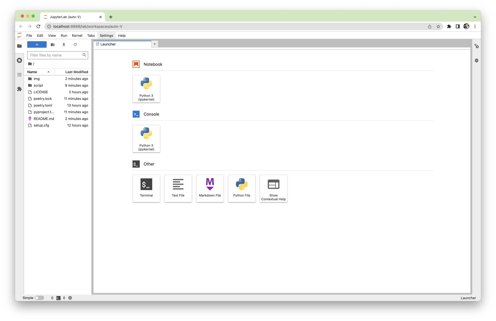

# Proof of solvency

* This is the demo code for XREX to generate the merkle sum tree

* Please check the live demo code on [Online Colab](https://colab.research.google.com/drive/161CdLfITR0T7U042y2MXa3ob9bxtpqs_?usp=sharing)

## I. Folder Structure

```markdown
.
├── script                              # script for demo merkle sum tree
│   ├── xrex_merkle_sum_tree.py         # python version for demo merkle sum tree
│   ├── xrex_merkle_sum_tree.ipynb      # jupyter version for demo merkle sum tree
│   └── data                            # folder for saving the tree data/pdf
├── pypoetry.toml                       # file about setting project environment
├── poetry.toml                         # file about setting project environment
├── poetry.lock                         # file about setting project environment
├── setup.cfg                           # file about setting project environment
└── README.md                           # Read me
```

## II. Set up poetry for python virtual environment

* please download [poetry](https://python-poetry.org/en/latest/) first and install it
 ```shell
brew install poetry
## or `pip install poetry`
```

* activate virtual environment
```shell
poetry env use <python version>
## or `poetry shell` to create the environment by default python version
```

* install package
```shell
poetry install
```

## III. Run the script in jupyterlab
1. Run the jupyter lab
```shell
# enter virtual environment
poetry shell
# start the jupyter lab
jupyter lab
```
2. Run the code in website



## IV. Run the script by python
```shell
# enter virtual environment
poetry shell
# run the code
python xrex_merkle_sum_tree.py
```

## V. License
[MIT](LICENSE) © 2022 XREX.INC
